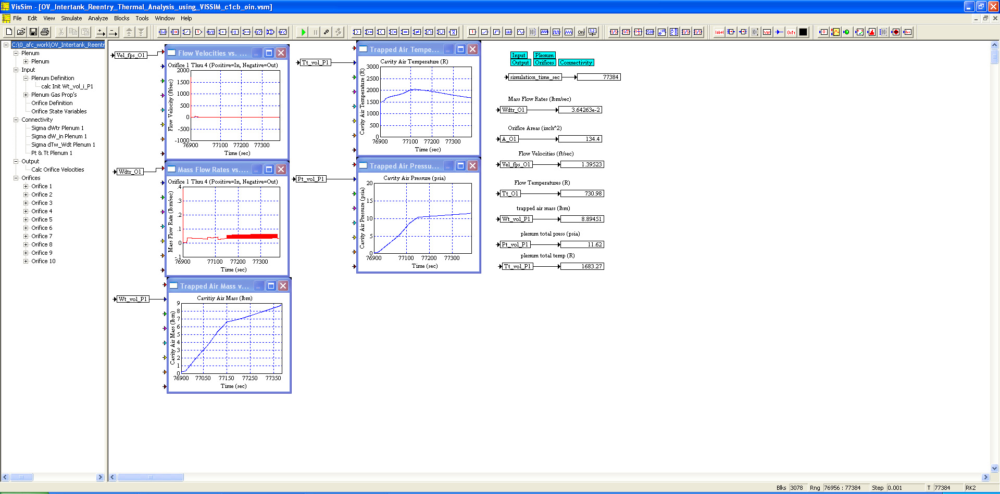
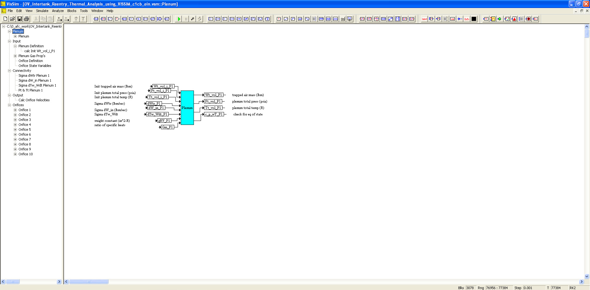
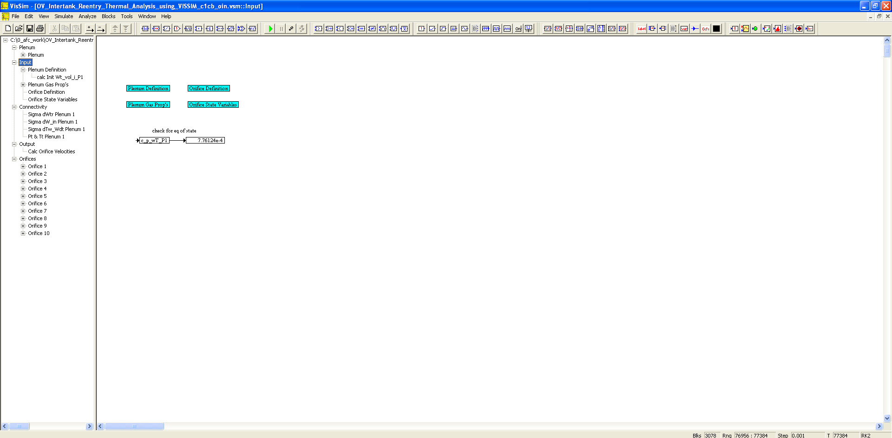
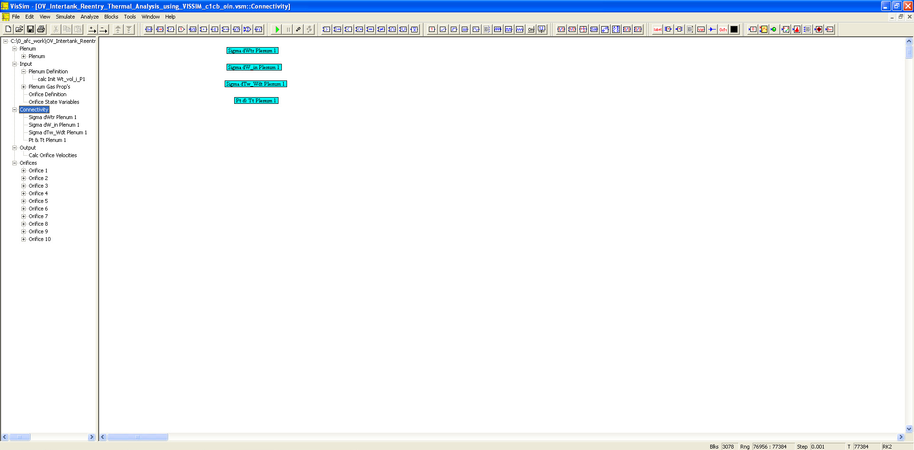
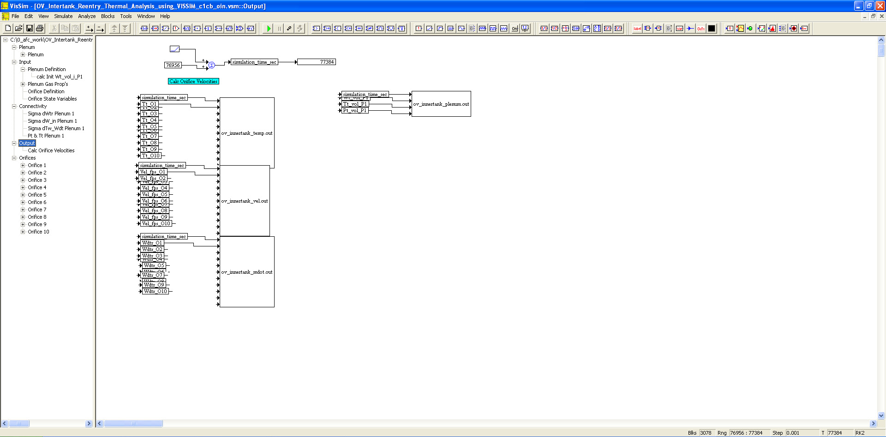
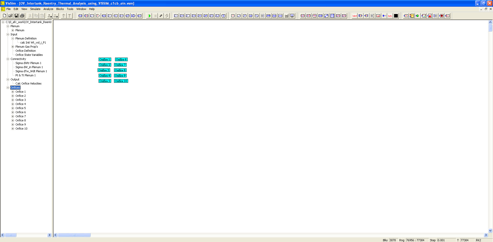

# ========================================
# Orbital Vehicle Intertank Reentry Thermal Analysis using VISSIM:
# ========================================

## Orbital Vehicle Intertank Reentry Thermal Analysis using VISSIM.

##
## I. Operation: "./VISSIM/OV_Intertank_Reentry_Thermal_Analysis_using_VISSIM_c1cb_oin.vsm"

##
## II. OV Intertank Reentry Thermal Analysis Top Level Diagram:

##
## III. Plenum Sub-System Level Diagram:

##
## IV. Input Sub-System Level Diagram:

##
## V. Connectivity Sub-System Level Diagram:

##
## VI. Output Sub-System Level Diagram:

##
## VII. Orifices Sub-System Level Diagram:

##
#### XIIIa. Results: "./VISSIM/ov_intertank_mdot.out"
#### XIIIb. Results: "./VISSIM/ov_intertank_plenum.out"
#### XIIIc. Results: "./VISSIM/ov_intertank_temp.out"
#### XIIId. Results: "./VISSIM/ov_intertank_vel.out"

## 
## *Note: 
## 1. Performance Data and Analysis performed using VISSIM, ( https://web.solidthinking.com/vissim-is-now-solidthinking-embed )

